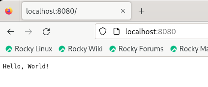

# A simple GO_app to practice multi staging in docker
## To build image use below commands
```bash
docker build -t go_app  .
docker build -t multistage_go  -f Dockerfile_multistage .
```
## Comparing image size before and after multi staging
 ```bash
$ docker images
REPOSITORY      TAG       IMAGE ID       CREATED             SIZE
go_app          latest    ffadc723b360   26 minutes ago      303MB
multistage_go   latest    da38f02272c5   About an hour ago   12.6MB
```
## To run a container based on created images use below commands
```bash
docker run -d --name app1 -p 8080:8080 go_app
docker run -d --name app2 -p 8085:8080 go_app
```
## Running Containers
```bash
$ docker ps
CONTAINER ID   IMAGE     COMMAND       CREATED          STATUS          PORTS                                       NAMES
6cc932755fcc   go_app    "/app/main"   25 seconds ago   Up 24 seconds   0.0.0.0:8085->8080/tcp, :::8085->8080/tcp   app2
d90ffcc13e39   go_app    "/app/main"   42 seconds ago   Up 40 seconds   0.0.0.0:8080->8080/tcp, :::8080->8080/tcp   app1
```
## To access containers
  In the browser's address bar, enter `http://localhost:8080` & `http://localhost:8085` and press Enter.
  
  
