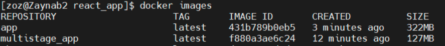
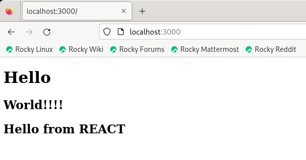

# A simple reactjs app to practice multi staging in docker
## To build image use below commands
```bash
docker build -t app .
docker build -t multistage_app -f dockerfile_multiStage .
```
## Comparing image size before and after multi staging
 
 
## To run a container based on created images use below commands
```bash
docker run -d -p 3000:3000  app
docker run -d -p 3000:3000  multistage_app
```
**note:** if you want to run both containers at same time, map different port on your host machine to the second container.
## To access container
  In the browser's address bar, enter `http://localhost:3000` and press Enter.
  
